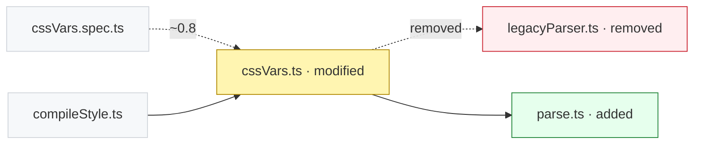

# DiffScope

DiffScope is a performance-driven tool for understanding the scope and impact of code changes.

It compares revisions and reports:

- Lines added, removed, and changed
- Files and functions touched by a diff
- Before-and-after function metrics, including LOC, cyclomatic complexity, and cognitive complexity
- Per-function diff churn, changes to a module's export surface, and how confidently each function was matched across revisions

DiffScope is designed around a reusable analysis core. It is available as a command-line application, a Model Context Protocol (MCP) server for coding agents, and a low-level JSONL protocol for adapters that manage the process themselves.

The project prioritizes correctness, deterministic output, safe Rust, and measured performance. See [`AGENTS.MD`](AGENTS.MD) for its development rules.

## Install

One command installs the binary for the host platform and connects the coding harnesses already on the machine.

Linux and macOS:

```sh
curl -fsSL https://raw.githubusercontent.com/ieVictor/diffscope/master/scripts/install.sh | bash
```

Windows:

```powershell
irm https://raw.githubusercontent.com/ieVictor/diffscope/master/scripts/install.ps1 | iex
```

The installer downloads the release archive from [GitHub Releases](https://github.com/ieVictor/diffscope/releases), verifies its SHA-256 digest against the release's `SHA256SUMS`, installs the binary

- to `~/.local/bin/diffscope` on Linux and macOS, printing a note if that directory is not on `PATH`, or
- to `%LOCALAPPDATA%\Programs\diffscope\bin\diffscope.exe` on Windows, adding that directory to the user `PATH` when it is missing,

runs the installed binary to confirm it starts, and then runs `diffscope setup` to configure the coding harnesses it detects. No `sudo` or administrator rights are needed.

Options:

| `install.sh` | `install.ps1` | Effect |
| --- | --- | --- |
| `--version v0.2.0` | `-Version v0.2.0` | Install a specific release instead of the latest one. |
| `--install-dir <dir>` | `-InstallDir <dir>` | Install into an absolute directory instead of the default. |
| `--no-setup` | `-NoSetup` | Install the binary only; run `diffscope setup` later. |

Flags for the POSIX installer go after `bash -s --`:

```sh
curl -fsSL https://raw.githubusercontent.com/ieVictor/diffscope/master/scripts/install.sh | bash -s -- --version v0.2.0 --no-setup
```

A piped PowerShell `iex` cannot pass arguments, so download the script when you need flags:

```powershell
iwr https://raw.githubusercontent.com/ieVictor/diffscope/master/scripts/install.ps1 -OutFile install.ps1
powershell -ExecutionPolicy Bypass -File .\install.ps1 -Version v0.2.0 -NoSetup
```

Supported platforms are Linux x86_64 and aarch64 (statically linked musl builds with no runtime dependency, so they run on any distribution of the same architecture), macOS x86_64 and arm64, and Windows x86_64 (MSVC). An unsupported platform fails with an explicit message instead of installing a binary built for another target.

Verify the installation:

```console
$ diffscope --version
diffscope 0.2.0
```

If `diffscope` is not found after installing, the installer's PATH note was not applied yet; open a new shell or add the install directory to your shell profile.

## Connect a coding agent

`diffscope mcp` is a Model Context Protocol server over standard input and output. Coding harnesses that speak MCP start it themselves from the configuration `diffscope setup` writes:

```sh
diffscope mcp
```

`diffscope mcp` takes no options: it is a server, not a one-shot command. Closing its standard input ends the session, and the process exits `0`. `setup` records the absolute path of the running binary and the argument `mcp`, so a harness always launches the exact installed build. It never manages the process itself and never replaces unrelated configuration.

### Setup in one command

```sh
diffscope setup
```

Without options, `setup` detects the harnesses installed on the machine and configures each one for the current user. It writes only the `diffscope` server entry: other servers and unrelated keys are left as they were, and rerunning it is idempotent — a second run reports the entry as unchanged and rewrites nothing. Writes are atomic, and a malformed configuration file aborts with an error naming the file, leaving it unchanged.

Useful invocations:

```sh
diffscope setup --harness all                # configure every supported harness
diffscope setup --harness claude,vscode      # configure an explicit list
diffscope setup --scope project              # write project-local configuration
diffscope setup --dry-run                    # report what would change, write nothing
diffscope setup --remove                     # remove the diffscope entries
```

| Option | Meaning |
| --- | --- |
| `--harness <all\|names>` | Comma-separated harness names, or `all`. Defaults to the installed harnesses detected on the machine. |
| `--scope <user\|project>` | Configuration scope. Defaults to `user`. |
| `--dry-run` | Print the action each harness would take without writing or invoking any harness CLI. |
| `--force` | Replace an existing `diffscope` entry that points at a different command. |
| `--remove` | Remove the `diffscope` entry instead of writing it. |

Supported harness names are `claude`, `codex`, `gemini`, `cursor`, `opencode`, and `vscode`. Each line of the report names the harness, the scope, the action, how the change was made (`cli:<program>` or `config`), the configuration file, and a one-sentence detail. The action is `created`, `replaced`, `unchanged`, or `skipped`, and for `--remove` it is `removed` or `not present`; under `--dry-run` it reads `would create`, `would update`, or `would remove`.

```text
diffscope setup (applied, scope user, executable /home/user/.local/bin/diffscope)
  cursor   user     created      config    ~/.cursor/mcp.json                     wrote the "diffscope" entry
  claude   user     unchanged    cli:claude ~/.claude.json                         entry already launches `/home/user/.local/bin/diffscope mcp`
```

| Harness | User scope | Project scope | Server entry |
| --- | --- | --- | --- |
| `claude` | `~/.claude.json` | `.mcp.json` | `mcpServers.diffscope` |
| `codex` | `~/.codex/config.toml` | not supported | `[mcp_servers.diffscope]` |
| `gemini` | `~/.gemini/settings.json` | `.gemini/settings.json` | `mcpServers.diffscope` |
| `cursor` | `~/.cursor/mcp.json` | `.cursor/mcp.json` | `mcpServers.diffscope` |
| `opencode` | `~/.config/opencode/opencode.json` | `opencode.json` | `mcp.diffscope` |
| `vscode` | `~/.config/Code/User/mcp.json` | `.vscode/mcp.json` | `servers.diffscope` |

`claude` honors `$CLAUDE_CONFIG_DIR`, `codex` honors `$CODEX_HOME`, and `opencode` follows `$XDG_CONFIG_HOME` when those variables are set. The VS Code user path is per-application state: `~/.config/Code/User/mcp.json` on Linux, `~/Library/Application Support/Code/User/mcp.json` on macOS, and `%APPDATA%\Code\User\mcp.json` on Windows. `claude`, `gemini`, and `codex` are configured through their own CLIs when those are on `PATH` — `claude` and `gemini` also merge the configuration file directly when their CLI is absent. `codex` has no project-scope MCP configuration: `--harness codex --scope project` is an error, and a bulk selection reports codex as `skipped` so the other harnesses are still configured.

The written entry runs the absolute path of the installed binary with the single argument `mcp`, for example:

```json
{
  "mcpServers": {
    "diffscope": { "command": "/home/user/.local/bin/diffscope", "args": ["mcp"] }
  }
}
```

Harnesses differ in shape, not in meaning: VS Code records `"type": "stdio"`, and OpenCode records `{ "type": "local", "command": ["/home/user/.local/bin/diffscope", "mcp"], "enabled": true }`.

### Verify the configuration

```sh
diffscope doctor
```

`doctor` inspects the same selection as setup — `--harness` defaults to all six harnesses and `--scope` to `user` — and reports the checked executable, then one line per harness:

```text
diffscope doctor (scope user, executable /home/user/.local/bin/diffscope)
  claude   user     configured    installed  ~/.claude.json                         entry launches this executable
  codex    user     missing       not found  ~/.codex/config.toml                   harness does not appear to be installed
  5 configured, 1 missing, 1 not installed
  configuration presence only: no live MCP handshake was performed
```

Statuses are `configured`, `stale` (the entry launches a different command), `missing`, `unrecognized` (the entry is not a stdio command), `invalid` (the file cannot be read or parsed), and `unsupported` (the harness has no configuration at the requested scope). A `stale` entry names the command it launches and tells you to rerun `diffscope setup --force`. `doctor` writes nothing, and it exits `1` when an installed harness is not correctly configured for the inspected scope and `0` otherwise. It reads configuration only: it never starts a harness and never opens an MCP session.

### Remove the configuration

```sh
diffscope setup --remove
```

This deletes only the `diffscope` server entry from each configured harness, leaving every other server and key as it was; configuration files are never deleted, and a harness that has no entry is reported as `not present`. Remove a single harness with `--harness cursor --remove`, or restrict a bulk removal to one scope with `--scope user --remove`.

The binary itself is removed with the platform's file tool:

```sh
rm ~/.local/bin/diffscope
```

```powershell
Remove-Item "$env:LOCALAPPDATA\Programs\diffscope\bin\diffscope.exe"
```

## Command line

Compare two committed Git revisions from the repository containing the current directory:

```console
$ diffscope HEAD~1 HEAD
DiffScope HEAD~1..HEAD
Repository: /home/user/project
10 changed files, +37 -23 (7 supported, 3 unsupported)
binary assets/file-1.bin (+0 -0)
  info binary_file: binary file is inventoried without source metrics
modified docs/file-1.md (+1 -1)
  info unsupported_language: unsupported language
modified docs/file-2.md (+1 -1)
  info unsupported_language: unsupported language
modified src/file-1.ts (+5 -3)
  modified calculate1 [loc 6/6, cyclo 2, cognitive 1 -> loc 6/6, cyclo 3, cognitive 2]
  added format1 [- -> loc 1/1, cyclo 1, cognitive 0]
modified src/file-2.ts (+5 -3)
  modified calculate2 [loc 6/6, cyclo 2, cognitive 1 -> loc 6/6, cyclo 3, cognitive 2]
  added format2 [- -> loc 1/1, cyclo 1, cognitive 0]
...
```

Each file line carries its status and diff totals; each function line carries its change status and before-and-after `loc`, cyclomatic complexity, and cognitive complexity. An added function has no before side and shows `-`.

Use `--repository <PATH>` to select another repository and `--format json` for the complete analysis document, a versioned schema (`schema_version: 1`). Human output is the default. Successful and partially supported analyses exit with status `0`, analysis failures with `1`, and invalid command-line usage with `2`. Diagnostics never fail a run by themselves: an unsupported language or a binary file is reported and the rest of the comparison still succeeds.

```console
$ diffscope --format json HEAD~1 HEAD | jq .summary
{
  "changed_files": 10,
  "added_lines": 37,
  "removed_lines": 23,
  "supported_files": 7,
  "unsupported_files": 3,
  "diagnostics": { "info": 3, "warning": 0, "error": 0 }
}
```

`diffscope graph` answers the relationships of the same comparison instead of its numbers: which modules import a changed file, which tests cover it, and — rooted at a function — which functions it calls in its own file and which of them call it there, together with which of those relationships the change added or removed. It walks from one changed file (`--file`), from one function (`--function`), or from the whole changed set, and it renders the result as a dependency diff:

```console
$ diffscope graph --file packages/compiler-sfc/src/style/cssVars.ts --format diff origin/main HEAD
  packages/compiler-sfc/__tests__/cssVars.spec.ts -[tested_by]-> packages/compiler-sfc/src/style/cssVars.ts
  packages/compiler-sfc/src/compileStyle.ts -> packages/compiler-sfc/src/style/cssVars.ts
- packages/compiler-sfc/src/style/cssVars.ts -> packages/compiler-sfc/src/style/legacyParser.ts
+ packages/compiler-sfc/src/style/cssVars.ts -> packages/compiler-sfc/src/style/parse.ts
```

Each line is one relationship, ordered by source, relation, and target: `-` marks what the change removed, `+` what it added, and an unchanged line is the context the graph kept. `imports` is the unnamed default, and a relation other than it is named.

`--format mermaid` emits a `flowchart LR` document instead: a fixed style per node status, a dashed form for a removed relationship, and a dashed form carrying the confidence for a relationship resolved below certainty:



| Option | Meaning |
| --- | --- |
| `--file <PATH>` | Root the graph at one changed file. With no root, the graph is centered on the changed set. |
| `--function <FUNCTION_ID>` | Root the graph at one function, by the `function_id` a listing reports. Mutually exclusive with `--file`. |
| `--direction <upstream\|downstream\|both>` | Which way to walk. Default `both`. |
| `--relations <NAMES>` | Comma-separated relations. Defaults to all supported: `imports`, `tested_by`, `calls`, `contains`, `re_exports`. |
| `--depth <N>` | Hops from the root. Default `1`, clamped to 1–3. |
| `--view <delta\|base\|target>` | Which revision's relationships to show. Default `delta`. |
| `--max-nodes <N>` | Node budget. Default `30`, clamped to 3–100. |
| `--max-edges <N>` | Edge budget. Default `60`, clamped to 3–200. |
| `--format <text\|diff\|mermaid\|json>` | Output form. Default `text`: the comparison, the root, the dependency diff, and whether a diagram is recommended. `diff` and `mermaid` print that rendering alone, so the output can be piped, and `json` prints the same answer the query API returns. |

A relation outside `imports`, `tested_by`, `calls`, `contains`, and `re_exports`, a root the comparison does not contain, and naming both `--file` and `--function` are rejected with an error naming what is accepted, rather than answered with a misleadingly empty graph. A call resolves against a name the caller's file declares, against a named or default import that leads to an exported function, or against `ns.name()` where `ns` is a namespace import; a re-export chain resolves at lower confidence. Everything else produces no `calls` edge in this version: a computed or chained callee, a member call on anything but a namespace import, a specifier that names no file in the revision, a name reached only through `export *`, and an ambiguous name. Callers in other files come from the changed file's direct importers, so a caller that reaches it only through a barrel module is not reported.

The reusable Rust entry point is `diffscope::analyze(&AnalysisRequest)`. Renderers in `diffscope::output` consume the returned `AnalysisResult` and do not perform analysis.

## MCP server

`diffscope mcp` serves six read-only tools over one Git comparison. Every call names the comparison explicitly, so a tool cannot analyze the wrong tree:

| Tool | Answers |
| --- | --- |
| `get_change_summary` | Counts, per-area totals, and a ranked shortlist of review candidates. |
| `list_changed_files` | Ranked changed files, with classification, change shape, export changes, reach, and diagnostics. |
| `list_changed_functions` | Ranked changed functions, each addressed by `function_id`, with metrics, churn, risk, and review priority. |
| `get_function_change` | One function by `function_id`: its hunks, its reach, and its diagnostics. |
| `get_analysis_diagnostics` | Diagnostics, optionally scoped to one `file`. |
| `get_impact_graph` | The relationships a comparison added, removed, or left in place — module imports and test links, and, rooted at a `function_id`, the calls it makes in its own file and receives there — with optional dependency-diff and Mermaid renderings. |

Every tool requires:

- `repository` — a path to the repository or to any path inside its work tree. Relative paths resolve against the server process's working directory.
- `base` and `target` — committed Git revisions, resolved by the repository's own ref rules. The working tree and index are never inputs.

The filter parameters are the ones the query API defines: `classification`, `minimum_risk`, `min_complexity_delta`, `status`, `file`, `include_unchanged`, `limit` (default 50, maximum 200), and `cursor`. `get_impact_graph` takes the shape of the walk instead: `file` or `function_id` (mutually exclusive roots; with neither, the graph is centered on the changed set), `direction` (`upstream`, `downstream`, or `both`), `relations` (any subset of `imports`, `tested_by`, `calls`, `contains`, and `re_exports`), `depth` (default 1, clamped to 1–3), `view` (`delta`, `base`, or `target`), `max_nodes` (default 30, clamped to 3–100), `max_edges` (default 60, clamped to 3–200), and `render` (any subset of `diff` and `mermaid`). A tool returns the same envelope as the JSONL protocol — the analysis identity, the applied query with its defaults, the answer, and, for the two list tools, a page — as both a text block and structured content. Passing a page's `next_cursor` back unchanged continues the list.

Failures are visible in the tool result rather than lost: an unknown `function_id` returns an error naming the closest known ids, and a cursor that belongs to another analysis is rejected instead of silently answering from the wrong list. The process keeps a small number of recent analyses, so the usual summary, then list, then detail sequence analyzes the comparison once.

The server writes protocol messages to standard output and diagnostics to standard error, so it is safe inside any MCP client. See [`docs/HARNESS.md`](docs/HARNESS.md) for the tool schemas, error codes, and the low-level JSONL protocol that shares the same queries.

## Ask your agent

Once a harness is configured, a request in plain language is enough. This prompt asks for the riskiest changed functions on a branch and the evidence behind the top one:

> Compare `main` to `HEAD` in this repository with diffscope. List the changed functions in production source ranked by review priority, then open the highest-priority newly added function and show me the hunks that touch it, the module's reach, and any diagnostics. Wrap up with one paragraph on why it is worth reviewing first.

The agent runs the comparison through the MCP tools in three steps:

1. `get_change_summary` with `{"repository": ".", "base": "main", "target": "HEAD"}` — the change is 49 files and more than 1 MB of JSON as a whole analysis, but the summary returns counts and up to five ranked `review_candidates` in a few kilobytes.
2. `list_changed_functions` with `{"classification": "source", "minimum_risk": "high", "limit": 10}` — a page of candidates, each with a `function_id`, metric deltas, churn, and the reasons behind its scores.
3. `get_function_change` with the chosen `function_id` — that function's hunks, `impact` (`direct_importers`, `nearby_importers`, `related_tests`), and diagnostics.

The observable outcome, measured on the Vue repository corpus in [`docs/PERFORMANCE.md`](docs/PERFORMANCE.md), is that the agent reports:

- `packages/runtime-core/src/renderer.ts#arrow:patch@target:379:25` as the top candidate, with review priority 8 of 14 and intrinsic risk 6 of 8, both `high`;
- why it ranks first: cognitive complexity up 6 to 45, cyclomatic complexity up 5 to 31, and a containing module that 12 files import directly;
- the second candidate, `packages/compiler-sfc/src/style/cssVars.ts#fn:stripComments@target:117:0`, a newly added function with cognitive complexity 34, 36 changed lines, and 5 modules importing its containing file directly;
- the hunks that touch the function, so the answer can be checked line by line.

Each answer carries the resolved base and target commits and the query that produced it, so a later reader can tell exactly what was compared without seeing the original request.

## Low-level JSONL protocol

Adapters that manage a DiffScope process themselves use `--jsonl`. It reads one request per line from standard input and writes and flushes exactly one response per non-empty line to standard output, continuing after request-level errors. The transport protocol version is `2`, and its query envelope is a separately versioned schema (`schema_version: 2`). The MCP server exposes the same six queries over the same projection code; the JSONL protocol additionally has an `analyze` method that returns the complete analysis document.

```sh
echo '{"protocol_version":2,"id":"1","repository":".","base":"main","target":"HEAD",
       "method":"list_changed_functions",
       "params":{"classification":"source","minimum_risk":"high","limit":10}}' | diffscope --jsonl
```

Every successful response carries the same envelope — the analysis it projected, the canonical query and defaults it applied, the answer, and, for list methods, a page — so an answer can be interpreted without the request that produced it. Lists paginate by opaque cursor, and one function is drilled into by the `function_id` a list reports.

Files are classified as source, test, generated, vendored, lockfile, config, or docs, so a caller can ask for production code alone. Ranking is a documented, deterministic score over measured quantities: each function carries an intrinsic-risk score and a review-priority score, and every score carries structured reasons with stable codes, so a caller can rank on the numbers or on the reasons behind them. See [`docs/HARNESS.md`](docs/HARNESS.md) for the request and response contract and [`docs/DEFINITIONS.md`](DEFINITIONS.md) for the queries, the classification rules, and the scoring models.

## Local development

Install the pinned development tools and run the local quality gate:

```sh
./scripts/bootstrap.sh
just check
```

Run performance benchmarks with:

```sh
just bench
just bench-cli
just bench-memory
```

See [`docs/PERFORMANCE.md`](docs/PERFORMANCE.md) for the generated corpus, methodology, and current baseline.
