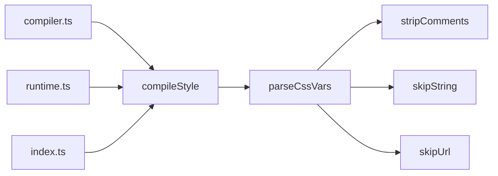
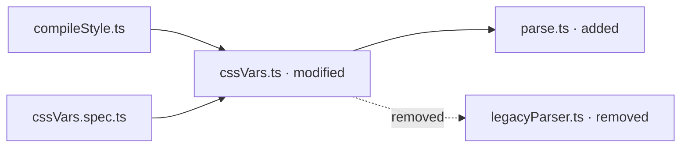

# Change-impact graph

This is a plan, not a delivered contract. Documents in `docs/` describe behavior DiffScope
has; documents in `docs/plans/` describe behavior it intends to have. Nothing here is binding
until the milestone that ships it moves its definitions into [`DEFINITIONS.md`](../DEFINITIONS.md)
and [`HARNESS.md`](../HARNESS.md).

## Purpose

DiffScope measures how large a change is. It cannot yet describe the shape of what the change
touches.

Today it answers which files and functions changed, how their metrics moved, how many modules
import a changed file, which tests are likely related, and where a reviewer should look first.
Every one of those is a number attached to a thing the diff contains. None of them answers:

- What calls the changed function, and what does it call?
- Which of those relationships did the change **add or remove**?
- Which unchanged code sits on the path the change can propagate along?
- Where does a replaced dependency leave its old callers?

That is a change from numerical impact to topological impact, and it is the natural next
question after "how risky is this function?" — because the answer to "why does it matter"
usually lives outside the function.

The objective is deliberately narrow:

> Generate a deterministic, revision-aware description of the dependency and impact changes a
> diff introduces, and render it visually only when the topology is materially easier to
> understand as a picture than as a list.

## What this is not

It is not a repository diagram generator. DiffScope will not draw a module map of a project, an
architecture overview, or the dependency graph of an unchanged revision. Every graph it produces
is anchored to a comparison and describes what that comparison changed.

The distinction is not stylistic. A tool that draws arbitrary diagrams has to decide what a
directory means, which is a judgment no diff contains — the same reason
[`DEFINITIONS.md`](../DEFINITIONS.md) already refuses to label a change area with anything but
its path. A tool that draws *change* diagrams only has to report edges it resolved, and every
edge can carry the evidence that produced it.

Two failure modes are ruled out by construction:

- **Diagrams nobody needs.** A graph is produced when asked for, and the response states
  whether one is recommended. Generating Mermaid for every changed function would produce many
  low-value, artificial-looking pictures and train readers to skip them.
- **Edges nobody can check.** Every edge carries its relation, how it was resolved, and a
  confidence derived from that resolution. There is no generic `depends_on`, because a caller
  cannot tell what evidence produced one.

## A diff, a dependency diff, and a diagram are three different answers

The three representations answer different questions, and the most compact one that answers the
question is the right one.

| Question | Best representation |
| --- | --- |
| Which lines changed? | Source diff |
| Which dependencies were added or removed? | Dependency diff |
| What is the resulting dependency structure? | Diagram |
| Where could the change propagate? | Impact diagram |
| Why is something considered risky? | Metrics and explanation |

A source diff is unquestionably better for changed conditions, new branches, altered arguments,
exception handling, algorithm changes, and renamed locals. DiffScope does not try to replace it,
and the graph never restates it.

For a small relationship change, a dependency diff is better than a diagram:

```text
- processCss -> legacyParser
+ processCss -> parseCssVars
+ parseCssVars -> stripComments
```

Three lines, exact, and nothing about the topology needs exploring. Rendering that as a flowchart
adds boxes without adding information.

A diagram earns its place when the reader would otherwise have to reconstruct a shape from a
list. These nine lines describe converging entry points and branching dependencies:

```text
+ compiler.ts -> compileStyle
+ runtime.ts -> compileStyle
+ index.ts -> compileStyle
+ compileStyle -> parseCssVars
+ parseCssVars -> stripComments
+ parseCssVars -> skipString
+ parseCssVars -> skipUrl
+ cssVars.spec.ts -> parseCssVars
+ compilerCssVars.spec.ts -> compileStyle
```

The same edges as a picture make the shape immediate — three entry points converge on
`compileStyle`, the change enters `parseCssVars`, and it branches into three parsing behaviors:



The value there is the convergence and the branching, not the colors. Change status is an
annotation layered onto a topology that is worth seeing; it is not itself a reason to draw.

That is why the response carries the structured graph, the dependency diff, and the diagram as
three renderings of one model, and why it states which one it recommends.

## Architecture

The graph is a projection, like every other query answer: it filters, traverses, and renders,
and it performs no analysis the comparison did not already produce. It reads two things DiffScope
already builds — the analysis of a comparison, and the import index of a revision — and adds
identity, status, traversal, and presentation over them.

```text
   Analysis of a comparison        Import index, base        Import index, target
              │                            │                          │
              └────────────┬───────────────┴──────────────────────────┘
                           ▼
                   Graph delta model
              (nodes, edges, identities,
               statuses, confidence)
                           │
              ┌────────────┼────────────┬───────────────────┐
              ▼            ▼            ▼                   ▼
        JSON response  Dependency    Mermaid          Visualization
                          diff       renderer         recommendation
```

Module layout:

```text
src/graph/mod.rs        # the model: node and edge types, identities, statuses, relations,
                        # resolutions, ordering, traversal, truncation. No serde, no I/O.
src/graph/build.rs      # build a delta graph from an AnalysisResult and two ImportIndexes
src/graph/render.rs     # dependency-diff and Mermaid renderers: pure string builders
src/graph/recommend.rs  # the deterministic visualization criteria
src/query/graph.rs      # request validation, serde views, the query projection
```

This mirrors the split the codebase already uses: `src/query/impact.rs` owns the domain types
`FileImpact` and `TestLink`, and `src/query/mod.rs` owns `ImpactView`, their serialized shape.
`src/graph/` depends on `crate::result` and `crate::imports` and on nothing above it, so the
model stays free of filesystem, terminal, and serialization concerns as
[`STRUCTURE.MD`](../STRUCTURE.MD) requires.

Presentation lives in adapters. `src/graph/render.rs` produces strings from the model and knows
nothing about transports; a later Graphviz or terminal-tree renderer is another function beside
it, not a change to the model.

## The model

### Nodes

A node is something a relationship can point at.

| Field | Meaning |
| --- | --- |
| `id` | Stable identity within one analysis. |
| `key` | Short render key, `n0`…`nN`, assigned in the graph's node order. |
| `label` | Human-readable name: a file basename or a qualified function name. |
| `kind` | `module`, `function`, or `group`. |
| `path` | Repository-relative path, target side when present, otherwise base side. |
| `status` | `added`, `removed`, `modified`, or `unchanged`. |

Identities are derived, never invented:

- A module node is `module:<path>`.
- A function node is `function:<function_id>`, reusing the identifier
  [`DEFINITIONS.md`](../DEFINITIONS.md) already defines as collision-safe within one analysis.
  Inventing a second function identity would give a caller two handles for one function and no
  rule for which to use.
- A `group` node is a synthetic node standing for several collapsed nodes. It carries the count
  it replaces and is identified by what it collapses, so the same collapse produces the same id.

`key` exists because Mermaid node identifiers cannot contain arbitrary punctuation and a
path-shaped identifier makes the source unreadable. Assigning `n0`…`nN` in the graph's own
deterministic order keeps the rendered source stable and short, and keeps the real identity in
`id` where a machine can use it.

### Edges

An edge is one resolved relationship, and it carries the evidence for itself.

| Field | Meaning |
| --- | --- |
| `from`, `to` | Node ids. |
| `relation` | What kind of relationship this is. |
| `status` | `added`, `removed`, or `unchanged`. |
| `resolution` | How the edge was resolved. |
| `confidence` | Fixed by `resolution`. |
| `evidence` | `file` and `line` where the relationship is written, when a single site produced it. |

An edge has no `modified` status. An edge exists or it does not; a relationship whose *target*
changed is a removed edge and an added edge, which is exactly what a reader needs to see.

### Relations

```text
calls
imports
re_exports
references_type
extends
implements
tested_by
contains
possible_call
```

There is no `called_by`. It is a `calls` edge read backwards, and storing the reverse as its own
relation makes two facts out of one and invites the two to disagree. Direction of travel is a
property of the *traversal*, not of the edge: `direction` in the request decides which way the
walk follows edges.

There is no generic `depends_on`. A caller cannot tell whether such an edge came from a call, an
import, a type reference, or a guess, so it cannot decide whether to trust it.

### Resolution and confidence

Confidence is a function of how an edge was resolved, never a free-form number. This is the rule
`TestLink::confidence()` already follows in `src/query/impact.rs`: a fixed value per resolution
kind, documented with its reason, so two runs cannot disagree and a reader can look up what
`0.9` meant.

| Relation | Resolution | Confidence | Basis | Milestone |
| --- | --- | ---: | --- | --- |
| `imports` | `resolved_specifier` | 1.0 | An import statement whose specifier resolved to a path in the revision. | M1 |
| `tested_by` | `test_imports_module` | 0.9 | A test file imports the module directly. | M1 |
| `tested_by` | `test_name_matches_module` | 0.8 | A test file's name matches the module's, after extensions and test suffixes. | M1 |
| `contains` | `declaration` | 1.0 | The function is declared in the module. | M2 |
| `calls` | `direct_local_symbol` | 1.0 | The callee is an identifier declared in the same file. | M2 |
| `calls` | `imported_symbol` | 1.0 | The callee is a named import resolving to an exported definition. | M3 |
| `re_exports` | `export_clause` | 1.0 | An export clause forwards a name from a resolved module. | M3 |
| `calls` | `re_exported_symbol` | 0.9 | The callee resolves through one or more re-export hops. | M3 |
| `possible_call` | `property_name_match` | 0.5 | A property call whose name matches exactly one known function. | M4 |

The two `tested_by` values are the ones `src/query/impact.rs` already publishes, so a test that
`get_function_change` reports at `0.9` cannot appear in a graph at some other number.

`resolution` is a stable `snake_case` code rather than prose, because a caller selects on it.
`TestLink::reason()` returns prose today because it is shown to a person; an edge is filtered by
a machine.

### Status comes from membership, not from inference

Statuses are decided by which revision a thing is in, never estimated:

```text
in target, not in base  ->  added
in base, not in target  ->  removed
in both                 ->  unchanged
```

A node's status is stronger than membership because the analysis already computed it: a module
takes the file status the comparison reported, and a function takes its `FunctionChangeStatus`,
so `modified` means what it means everywhere else in DiffScope.

This is why both revisions are indexed. A graph built from the target alone can show what exists
now; it cannot prove that anything was removed, and a delta that cannot show removals is not a
delta. The cost is stated under [Performance](#performance).

## Traversal

A walk starts at a root and follows edges outward, bounded on every axis.

- **Root.** A module, a function, or none. With no root, the graph is centered on the changed
  set: every changed file becomes a root, and the walk proceeds from all of them.
- **`direction`.** `upstream` follows edges backwards (what reaches the root), `downstream`
  follows them forwards (what the root reaches), `both` does both. Default `both`.
- **`depth`.** Hops from the root, default **1**, clamped 1–3. One level of callers and one of
  callees is the readable default; deeper walks are available, not automatic.
- **`relations`.** Which relations the walk may follow. Defaults to every relation the running
  version supports.
- **`view`.** `delta` (default), `base`, or `target`. `base` and `target` restrict the edge set
  to one revision. Statuses still describe the comparison, so an edge shown under `target` still
  reads `added` — the view narrows what is shown, it does not change what is true.

The walk is breadth-first and records the fewest hops by which each node was reached, matching
`ImportIndex::reachable_importers`. Cycles are retained: a node already seen is not re-queued,
but the edge that closed the cycle is kept, because a cycle introduced by a change is one of the
more interesting things a graph can report.

## Truncation

A graph that shows everything reachable shows nothing. Every walk is bounded and every omission
is reported.

Defaults: **30 nodes**, **60 edges**. Both are request parameters.

When a budget is reached, nodes are kept in this order:

1. the root or roots;
2. changed nodes — `added`, `removed`, or `modified`;
3. remaining nodes by hop distance, nearest first;
4. the graph's node ordering, as a total tiebreak.

Edges are kept when both endpoints were kept, then by the edge ordering. What was dropped is
reported:

```json
{"truncated": true,
 "omitted": {"nodes": 47, "edges": 83},
 "reasons": ["max_nodes"]}
```

A count is not a substitute for the nodes, but it is the difference between a small graph and a
misleading one. From M4, collapsed tails also appear as one `group` node carrying its size, so
the picture says "12 direct callers" rather than silently showing three of them.

## Determinism

Identical inputs must produce byte-identical output, including the rendered source. The graph
achieves that by:

- deriving node identities from stable identities — paths and `function_id` — never from
  iteration order;
- ordering nodes by kind, then path, then range start, then qualified name;
- ordering edges by source node, then relation, then target node, then resolution;
- assigning render keys from the node order, after ordering, so a key is a function of the graph
  and not of how it was built;
- fixed traversal rules, fixed depth and budget defaults, and a fixed truncation preference
  order;
- sanitizing labels identically every time;
- a fixed status-to-style mapping in the renderer;
- carrying the resolved base and target commits in the envelope, as every query answer already
  does;
- never putting a generated description in a label. Labels are file basenames and qualified
  names. A model-written summary in a diagram is not reproducible and cannot be checked against
  the code.

One nuance is worth stating plainly: the Mermaid **source** is deterministic, and that is what
DiffScope controls. Rendered geometry belongs to the Mermaid version and layout engine that draw
it, so identical pixels require pinning those. For a README or an agent's answer, deterministic
source is what matters.

## Renderings

### Dependency diff

The compact form, and the right answer for most changes.

```text
- packages/compiler-sfc/src/style/cssVars.ts -> packages/compiler-sfc/src/legacyParser.ts
+ packages/compiler-sfc/src/style/cssVars.ts -> packages/compiler-sfc/src/parse.ts
  packages/compiler-sfc/src/compileStyle.ts -> packages/compiler-sfc/src/style/cssVars.ts
```

Lines are ordered by the edge ordering, so a removal and the addition that replaced it appear
together. `-` and `+` mark removed and added edges; a leading space marks an unchanged edge,
included only for the context the graph kept. A relation other than `imports` is named:

```text
+ packages/compiler-sfc/__tests__/cssVars.spec.ts -[tested_by]-> packages/compiler-sfc/src/style/cssVars.ts
```

### Mermaid



Rules:

- A fixed `classDef` per node status, so the same status always looks the same.
- A `removed` edge renders `-. "removed" .->`.
- An edge below confidence 1.0 renders `-. "~0.55" .->`.

The last two matter separately. A single dashed style for both cannot distinguish "this call is
gone" from "we are not sure this call exists", and those are opposite statements about the
reader's confidence.

Labels are quoted, have newline and control characters collapsed to single spaces, and are
truncated to the 64-byte budget `MAX_SEGMENT_BYTES` already applies to identity segments, with
`...` appended. An arbitrarily long name in a repository must not produce an arbitrarily long
diagram line.

## When a diagram is recommended

The response states whether a diagram is worth rendering, and why. The criteria are fixed
thresholds over measured quantities, each contributing one reason in the
`{code, message, value}` shape the risk models already use. There is no score: a "diagram
score" would be an opaque number where an explainable list works.

A diagram is recommended when at least one positive signal applies and the negative signal does
not.

| Signal | Trigger | Available |
| --- | --- | --- |
| `many_callers` | Three or more relationships point at the root. | M1 |
| `many_dependencies` | The root points at three or more. | M1 |
| `converges_and_branches` | Callers converge on the root and dependencies branch from it. | M1 |
| `crosses_areas` | The graph spans two or more change areas. | M1 |
| `cycle` | The graph contains a cycle. | M1 |
| `changed_on_both_sides` | Relationships changed on the inbound and the outbound side. | M1 |
| `multiple_levels` | Changed relationships appear at more than one hop from the root. | M2 |

One negative signal overrides all of them:

| Signal | Trigger |
| --- | --- |
| `linear_and_small` | Fewer than four nodes and no branching. |

That is the straight line that should always be a dependency diff. Change areas reuse the
derivation already in `src/query/mod.rs`, so "crosses two packages" means the same thing here as
in a change summary.

## Query contract

One operation. The structured graph is always returned; renderings are returned when asked for.

```json
{"protocol_version": 2, "id": "request-1",
 "repository": "/path/to/repo", "base": "origin/main", "target": "HEAD",
 "method": "get_impact_graph",
 "params": {"file": "packages/compiler-sfc/src/style/cssVars.ts",
            "direction": "both",
            "relations": ["imports", "tested_by"],
            "depth": 1,
            "view": "delta",
            "max_nodes": 30,
            "max_edges": 60,
            "render": ["diff", "mermaid"]}}
```

| Parameter | Accepts | Default |
| --- | --- | --- |
| `file` | A changed file's path. | none |
| `function_id` | A `function_id` the analysis contains. | none |
| `direction` | `upstream`, `downstream`, `both` | `both` |
| `relations` | Any subset of the supported relations. | every supported relation |
| `depth` | 1–3 | 1 |
| `view` | `delta`, `base`, `target` | `delta` |
| `max_nodes` | 3–100 | 30 |
| `max_edges` | 3–200 | 60 |
| `render` | Any subset of `diff`, `mermaid`. | `[]` |

`file` and `function_id` are mutually exclusive; naming neither centers the graph on the changed
set. A relation the running version does not support is `invalid_params` naming what it accepts,
never a silently empty answer — [`ROADMAP.md`](../ROADMAP.md) requires an incomplete capability
to be explicit.

`render` defaults to empty because an agent that will reason over the graph should not pay to
serialize a diagram it will not show, and one that will relay Mermaid asks for it by name.

The answer uses the standard envelope — `analysis`, `query`, `data`, no `page`:

```json
{"data": {
  "root": {"kind": "module",
           "id": "module:packages/compiler-sfc/src/style/cssVars.ts",
           "path": "packages/compiler-sfc/src/style/cssVars.ts"},
  "graph": {
    "nodes": [
      {"id": "module:packages/compiler-sfc/src/style/cssVars.ts", "key": "n0",
       "label": "cssVars.ts", "kind": "module",
       "path": "packages/compiler-sfc/src/style/cssVars.ts", "status": "modified"}
    ],
    "edges": [
      {"from": "module:packages/compiler-sfc/src/compileStyle.ts",
       "to": "module:packages/compiler-sfc/src/style/cssVars.ts",
       "relation": "imports", "status": "unchanged",
       "resolution": "resolved_specifier", "confidence": 1.0,
       "evidence": {"file": "packages/compiler-sfc/src/compileStyle.ts", "line": 12}}
    ],
    "truncated": false,
    "omitted": {"nodes": 0, "edges": 0},
    "reasons": []
  },
  "dependency_diff": "- …\n+ …\n",
  "mermaid": "flowchart LR\n…",
  "visualization": {
    "recommended": true,
    "reasons": [
      {"code": "many_callers", "message": "5 modules import the changed file", "value": 5},
      {"code": "crosses_areas", "message": "the graph spans 2 change areas", "value": 2}
    ]
  }
}}
```

The query envelope stays at `schema_version: 2`. A new method is an additive change, which
[`ROADMAP.md`](../ROADMAP.md) permits within a version; no existing answer changes shape.

## Command line

```sh
diffscope graph --file packages/compiler-sfc/src/style/cssVars.ts \
  --direction both --depth 1 --format mermaid origin/main HEAD
```

| Option | Meaning |
| --- | --- |
| `--file <PATH>` | Root the graph at one changed file. |
| `--function <FUNCTION_ID>` | Root the graph at one function. |
| `--direction <upstream\|downstream\|both>` | Which way to walk. Default `both`. |
| `--relations <NAMES>` | Comma-separated relations. Defaults to all supported. |
| `--depth <N>` | Hops from the root. Default `1`. |
| `--view <delta\|base\|target>` | Default `delta`. |
| `--max-nodes <N>`, `--max-edges <N>` | Budgets. Default `30` and `60`. |
| `--format <text\|diff\|mermaid\|json>` | Default `text`. |

`text` is the human rendering: the comparison, the root, the dependency diff, and whether a
diagram is recommended. `diff` and `mermaid` emit that rendering alone, so the output can be
piped. `json` emits the same envelope the query API returns.

`diffscope graph` is the first CLI path into the query layer; the CLI renders whole analyses
today and otherwise runs `mcp`, `setup`, and `doctor`. It routes through the same projection the
harness uses, so a CLI answer and a harness answer for one comparison cannot drift — the
equivalence Milestone 7 already requires.

## Performance

The import index is built over a whole revision and is the dominant cost of any query that uses
it: 412 ms on a Vue revision of 702 files, of which 381.5 ms is parsing
([`PERFORMANCE.md`](../PERFORMANCE.md)). Indexing the base as well as the target roughly doubles
that on a comparison's first query — about 25 ms on the large generated tier, about 0.8 s on Vue
— and costs nothing after it, because each index is keyed by the commit it describes and shared
by every comparison that touches that commit.

That is the price of a delta that can prove a removal, and it is paid in the one place the
project already accepts a whole-revision cost.

Two consequences for the implementation:

- `MAX_CACHED_INDEXES` is 4, which is two comparisons' worth once both sides are indexed. It
  grows with this change, or one comparison evicts the previous one's pair.
- The graph is built only for the method that uses it, as the import index already is.

Function-level resolution has a harder constraint, and it decides the shape of M2 and M3.
Finding what *calls* a changed function means reading files the diff does not contain. Reading
every file of a revision whole, merely to extract its imports, already costs 676 ms on Vue
against 381.5 ms for the bounded prefix — and that is parsing alone, before the function
collector, which is roughly half of analysis time. Parsing a whole revision for call sites is
not affordable.

It is also not necessary. A file can only call into a changed module if it imports it, and the
import index already names those files. Full parsing is therefore restricted to the direct
importers of changed files, a set that is small even in a large repository. This bound is the
reason function-level impact is feasible at all, and every later milestone stays inside it.

## Milestones

Each is a complete, shippable increment. [`ROADMAP.md`](../ROADMAP.md)'s nine milestones are
delivered, so these are the stages of **Milestone 10: change-impact graph**.

| Stage | Makes answerable | Document |
| --- | --- | --- |
| M1 | Which modules import the changed file, which tests cover it, and which of those relationships the change added or removed. | [M1](IMPACT-GRAPH-M1-MODULES.md) |
| M2 | What a changed function calls within its own file, and what calls it there. | [M2](IMPACT-GRAPH-M2-CALLS.md) |
| M3 | What calls a changed function from other files, through named imports and re-exports. | [M3](IMPACT-GRAPH-M3-SYMBOLS.md) |
| M4 | The same answers, readable at scale, with uncertain relationships marked and missing ones admitted. | [M4](IMPACT-GRAPH-M4-READABILITY.md) |

M1 is valuable on its own: it uses only relationships DiffScope already resolves, and
"which modules and tests does this change reach, and what changed about that" is the question
reviewers ask first. A perfect TypeScript call graph is not a prerequisite for shipping
something useful.

## Deliberately deferred

- **`references_type`, `extends`, `implements`.** Defined in the vocabulary, resolved by no
  milestone here. They are listed so the relation set does not have to change shape when they
  arrive, not because they are planned.
- **Graphviz, terminal trees, interactive graphs.** The renderer boundary exists so these are
  additions rather than redesigns. None is planned.
- **Cross-language graphs.** TypeScript is the only analyzed language; the model has nothing
  language-specific in it, and a second language brings its own resolution rules.
- **A diagram attached to `get_function_change`.** Recommending a diagram from a detail answer
  is plausible and is left to M4, once there are call-level signals worth recommending on.
